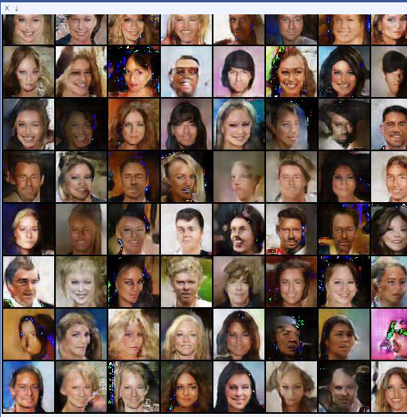

Just another DCGAN implementation
=================================

This implements dcgan as described in this [paper](https://arxiv.org/abs/1511.06434). It is slightly different from the implementation by soumith et al that the filter size in the first layer of generator is 1024 as described in the paper.

We train on the [celebA dataset](http://mmlab.ie.cuhk.edu.hk/projects/CelebA.html). The generator learns to output faces after few epochs. In fact, the results start to appear non-random early on. Below are the result after 5 epochs.

