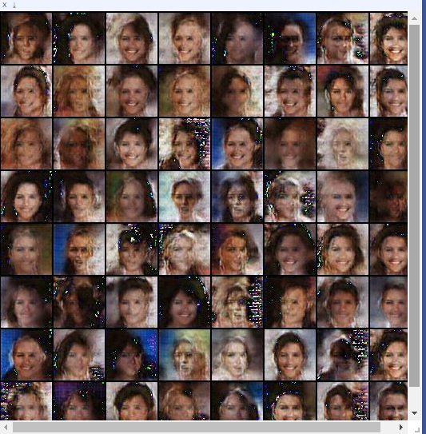

Just another DCGAN implementation
=================================

This implements dcgan as described in this [paper](https://arxiv.org/abs/1511.06434). It is slightly different from the implementation by soumith et al that the filter size in the first layer of generator is 1024 as described in the paper. Below are the result after just one epoch.

